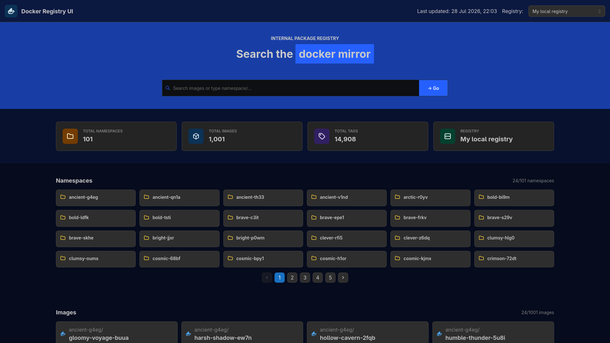

# Offbrand Container

A modern web application for browsing and visualising the contents of self-hosted Docker registries.

Offbrand Container provides a clean interface for exploring container repositories and images across one or more registries. Configure your registries in a simple YAML file, start the application, and browse your images from a single dashboard.

> Part of the **Offbrand** series, alongside **Offbrand Nodules** and **Offbrand Pet**.



---

## Features

* Browse multiple Docker registries from a single interface
* Clean, responsive React frontend
* FastAPI backend
* PostgreSQL for data storage
* Simple YAML-based registry configuration
* Single Docker image containing both frontend and backend
* Example Docker Compose configuration included
* Supports self-hosted


---

## Getting Started

### Prerequisites

* Docker
* Docker Compose
* PostgreSQL (or use the included Docker Compose example)

### Running with Docker Compose

An example `docker-compose.yml` is included.

```bash
docker compose up -d
```

This starts:

* Offbrand Container
* PostgreSQL

The application is packaged as a **single Docker image** which builds the React frontend, packages it with the FastAPI backend, and serves everything from one container.

There is a script called collect that needs to be run to collect the data in to the db.

---

## Registry Configuration

Offbrand Container reads the list of registries from a YAML configuration file.

Example:

```yaml
registries:
  name:
    display_name: "My local registry"
    url: "http://0.0.0.0:5000"
    self_hosted: true

  name1:
    display_name: "display_name1"
    url: "http://0.0.0.0:5001"
    self_hosted: false
```

### Configuration Options

| Field          | Description                                   |
| -------------- | --------------------------------------------- |
| `display_name` | Friendly name shown in the UI                 |
| `url`          | Registry URL                                  |
| `self_hosted`  | Indicates whether the registry is self-hosted |

You can add as many registries as required.

---

## Development

### Backend

```bash
cd server

uv sync

fastapi dev
```

### Frontend

```bash
cd web

bun install

bun run dev
```

---

## Project Structure

```text
.
├── server/
│   └── registry.yml
├── web/
├── images/
│   └── home.png
├── docker-compose.yml
└── Dockerfile

```

---

## Why Offbrand Container?

Managing multiple container registries can quickly become tedious when relying on command-line tools alone. Offbrand Container provides a lightweight web interface for viewing your registry contents in one place, making it easier to explore repositories, tags, and images across your infrastructure.


---

## Part of the Offbrand Series

Offbrand Container is one application in the growing **Offbrand** family of self-hosting utilities.

* Offbrand Container - Docker
* Offbrand Nodules - Node
* Offbrand Pet - Python

---

## License

See the project's LICENSE file for licensing information.
